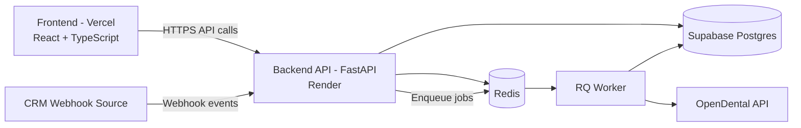
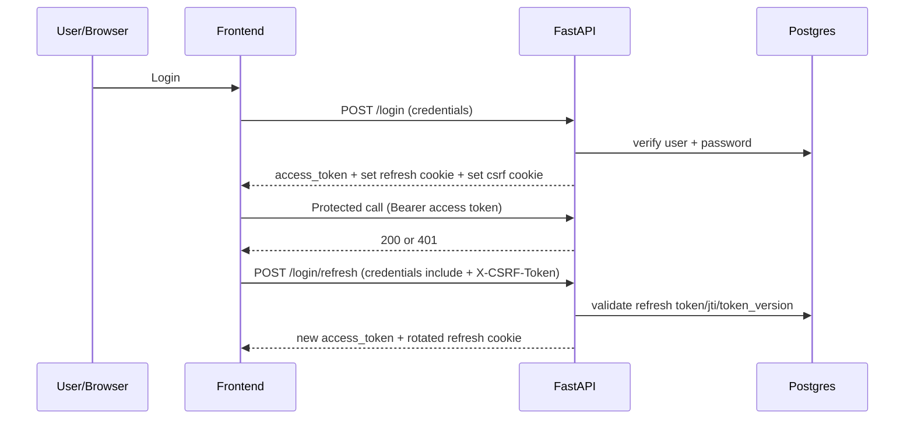
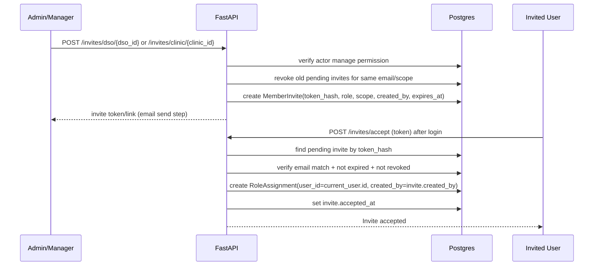

# OpenDental CRM Sync Architecture Blueprint

## 1) Why This Document Exists
This is the single source of truth for how your backend should work.
It explains:
- the full system shape,
- how auth + invites + RBAC should behave,
- how webhook processing flows,
- and the next implementation steps in order.

This document is written for junior engineers and fast onboarding.

## 2) High-Level System View

## 3) Core Architecture Principles
- Event-driven ingest for appointments (webhook -> queue -> worker).
- JWT auth for protected user endpoints.
- Refresh token in HttpOnly cookie, access token in frontend memory.
- CSRF protection for cookie-auth endpoints.
- RBAC scoped by DSO or Clinic.
- Invite-first membership assignment (not direct user_id assignment by default).

## 4) Authentication Architecture

### 4.1 Token Model
- Access token:
  - short-lived JWT,
  - sent in `Authorization: Bearer <token>`.
- Refresh token:
  - JWT in HttpOnly cookie (`refresh_token`),
  - rotated on refresh,
  - validated with `token_version` + `refresh_jti`.
- CSRF token:
  - non-HttpOnly cookie (`csrf_token`),
  - frontend echoes in `X-CSRF-Token` header for refresh/logout.

### 4.2 Auth Sequence

## 5) RBAC and Scope Model

### 5.1 Scope Types
- `dso`
- `clinic`

### 5.2 Role Types
- `admin`
- `manager`
- `staff`

### 5.3 Policy Summary
- DSO manage actions:
  - allow `admin`, `manager`
  - deny `staff`
- Clinic manage actions:
  - allow clinic `admin/manager`
  - allow DSO `admin/manager` for clinics inside that DSO
  - deny staff
- Read/access actions can be broader than manage actions.

## 6) Invite-Based Membership Architecture

### 6.1 Why Invite-First
Invite-first gives auditability and safer onboarding:
- who invited who,
- what scope was granted,
- token expiry/revocation support,
- no manual user_id guessing in frontend.

### 6.2 Invite Flow

### 6.3 Important Rule
`created_by` in `RoleAssignment` should be:
- `current_user.id` for direct admin-add endpoint,
- `invite.created_by` for invite-accept endpoint.

## 7) Data Model (Authorization Layer)

### 7.1 `role_assignments`
Purpose: active role grants for a user in a scope.

Key fields:
- `user_id`
- `scope_type` (`dso` or `clinic`)
- `dso_id` (nullable)
- `clinic_id` (nullable)
- `role`
- `is_active`
- `created_by`
- `created_at`

### 7.2 `member_invites`
Purpose: pending/accepted/revoked invitation records.

Key fields:
- `email`
- `token_hash` (unique)
- `scope_type`
- `role`
- `dso_id` / `clinic_id`
- `created_by`
- `expires_at`
- `accepted_at`
- `revoked_at`
- `created_at`

## 8) API Surface (Target)

### 8.1 Auth
- `POST /login`
- `POST /login/refresh`
- `POST /logout`

### 8.2 Registration
- `POST /register`
- `POST /DSO/`
- `POST /clinics/`
- `POST /clinics/dso/{dso_id}`

### 8.3 Invites
- `POST /invites/dso/{dso_id}`
- `POST /invites/clinic/{clinic_id}`
- `POST /invites/accept`

### 8.4 Optional Direct Membership (later)
- `POST /dso/{dso_id}/members`
- `POST /clinics/{clinic_id}/members`

Use these only if you intentionally support non-invite assignment.

## 9) Webhook and Appointment Processing

### 9.1 Current Flow
- CRM sends webhook to `/webhook/{crm_type}/{clinic_id}`.
- API validates clinic mapping and deduplicates in Redis.
- API enqueues job in RQ.
- Worker resolves patient + books/updates appointment in OpenDental.

### 9.2 Reliability Enhancements (Next)
- Add webhook signature HMAC verification.
- Use sync wrapper for async worker function in RQ.
- Add persistent inbound event table for replay/audit.

## 10) Deployment Architecture
- Frontend: Vercel
- Backend: Render
- DB: Supabase Postgres
- Queue/cache: Redis

### 10.1 Required production settings
- DB URL must enforce SSL.
- CORS should use explicit frontend domain, not `*` when using credentials.
- Refresh cookie: `HttpOnly=True`, `Secure=True`, `SameSite=None` for cross-site.
- CSRF cookie: readable by frontend and echoed via header.

## 11) Build Order (Step-by-Step)
1. Finalize `MemberInvite` + `RoleAssignment` schema and migrations.
2. Finalize invite endpoints and accept flow.
3. Add `/auth/me` endpoint for frontend role bootstrap.
4. Add direct membership endpoints only if needed.
5. Harden webhook auth and worker execution model.
6. Add monitoring and replay support.

## 12) Quick Testing Checklist
- Login returns access token + cookies.
- Refresh works with CSRF and rotates refresh token.
- DSO manager cannot invite manager.
- Clinic manager cannot invite manager.
- Invite token accepts only matching email.
- Expired/revoked token fails.
- Accept creates exactly one active `RoleAssignment`.
- Re-accept returns already member (idempotent behavior).

## 13) Ownership and Next File Targets
Immediate files to maintain:
- `core/models.py`
- `core/schemas.py`
- `infra/rbac.py`
- `api/invites.py`
- `main.py`

Optional later:
- `api/add_members.py`
- `workers/workers.py`
- `api/routers/webhook_crm.py`

